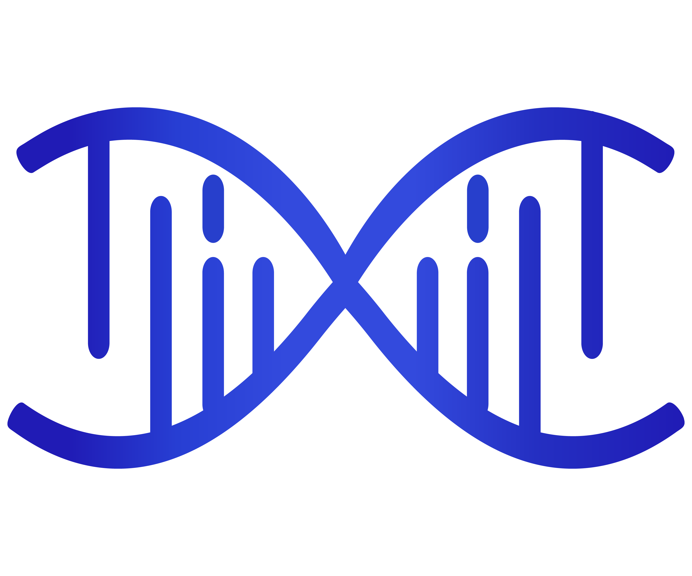

=============================
Welcome to XAgent's Document
=============================

Introduction
============

.. raw:: html

    

        
        
        
        
    

.. raw:: html

   

      🏆 Our goal is to create a super-intelligent agent that can solve any given task!
   

We welcome diverse forms of collaborations, including full-time and part-time roles and more. If you are interested in the frontiers of agents and want to join us in realizing true autonomous agents, please contact us at xagentteam@gmail.com.

XAgent is designed with the following features:
======================================================

- **Autonomy**: XAgent can automatically solve various tasks without human participation.
- **Safety**: XAgent is designed to run safely. All actions are constrained inside a docker container. Run it anyway!
- **Extensibility**: XAgent is designed to be extensible. You can easily add new tools to enhance agent's abilities and even new agents!
- **GUI**: XAgent provides a friendly GUI for users to interact with the agent. You can also use the command line interface to interact with the agent.
- **Cooperation with Human**: XAgent can collaborate with you to tackle tasks. It not only has the capability to follow your guidance in solving complex tasks on the go but also can seek your assistance when it encounters challenges.

XAgent is composed of three parts:
====================================

- **🤖 Dispatcher** is responsible for dynamically instantiating and dispatching tasks to different agents. It allows us to add new agents and improve the agents' abilities.
- **🧐 Planner** is responsible for generating and rectifying plans for tasks. It divides tasks into subtasks and generates milestones for them, allowing agents to solve tasks step by step.
- **🦾 Actor** is responsible for conducting actions to achieve goals and finish subtasks. The actor utilizes various tools to solve subtasks, and it can also collaborate with humans to solve tasks.

.. toctree::
   :glob:
   :maxdepth: 2
   :caption: Quickstart

   source/XAgent/Quickstart
   source/XAgent/Demo
   source/XAgent/Evaluation
   source/XAgent/FAQ

.. toctree::
   :glob:
   :maxdepth: 2
   :caption: ToolServer Reference

   source/ToolServer/README

.. toctree::
   :glob:
   :maxdepth: 3
   :caption: Comparison
   
   source/Others/Comparison