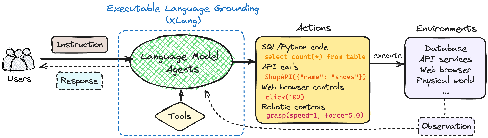
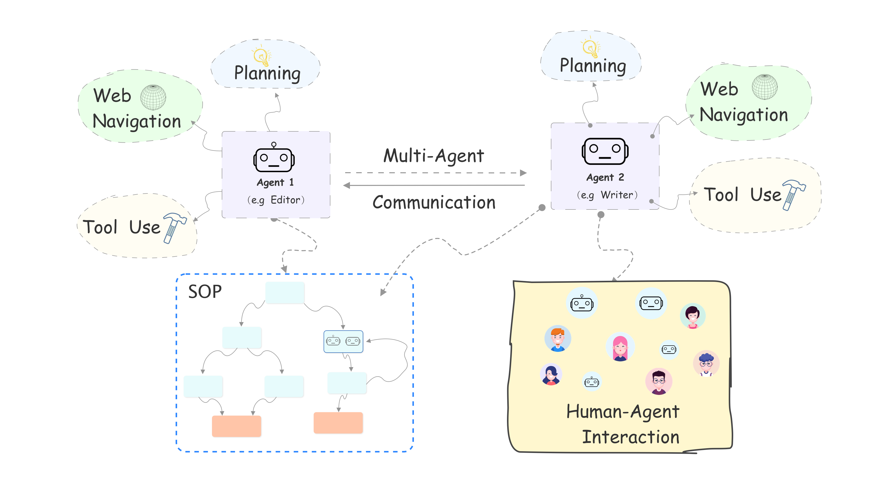

# Differences between XAgent, AutoGPT, and OpenAgents

> Generative agents are designed to simulate behavior in an open world, interacting with others and responding to environmental changes. They use their environment and past experiences to generate behavior.
> 
> Cooperative multi-agent systems are widely used in practice. In these systems, each agent assesses others' needs and capabilities, seeking collaboration and information sharing.

|                | Multiple LLM Support | GUI | Execution Environment | Plugins | Human Feedback | Tool Usage |
|----------------|:--------------------------:|:---:|:------------------------:|:-------:|:-----------------:|:-------------:|
| XAgent         | ✗                          | ✓   | Docker & Local           | ✗       | ✓                 | ✓             |
| AutoGPT        | ✗                          | ✓   | Docker & Local           | ✓       | ✓                 | ✓             |
| OpenAgents     | ✓                          | ✓   | Docker & Local           | ✓       | ✗                 | ✓             |

## Brief Overview

### [OpenAgents](https://github.com/xlang-ai/OpenAgents)

We built [OpenAgents](https://docs.xlang.ai/user-manual/overview), an open platform for using and hosting language agents in the wild of everyday life.
We have now implemented three agents in OpenAgents. [Paper](https://arxiv.org/abs/2310.10634)

- Data Agent for data analysis with Python/SQL and data tools;
- Plugins Agent with 200+ daily tools;
- Web Agent for autonomous web browsing.

We adopt & adapt LangChain to construct our agent. LangChain is a middleware/framework for building LLM-powered applications, with various built-in components to use LLMs as we need. Specifically, our agents are based on the ReAct in LangChain: a paradigm where an agent iteratively performs Thinking, Acting, and Observing to accomplish the assigned task(s)

### [XAgent](https://github.com/OpenBMB/XAgent)

XAgent is an open-source experimental Large Language Model (LLM) driven autonomous agent that can automatically solve various tasks. 

XAgent is composed of three parts:

- 🤖 Dispatcher is responsible for dynamically instantiating and dispatching tasks to different agents. It allows us to add new agents and improve the agents' abilities.
- 🧐 Planner is responsible for generating and rectifying plans for tasks. It divides tasks into subtasks and generates milestones for them, allowing agents to solve tasks step by step.
- 🦾 Actor is responsible for conducting actions to achieve goals and finish subtasks. The actor utilizes various tools to solve subtasks, and it can also collaborate with humans to solve tasks.

### [AutoGPT](https://github.com/Significant-Gravitas/AutoGPT)

[AutoGPT](https://docs.agpt.co/) is an experimental open-source application showcasing the capabilities of the GPT-4 language model. This program, driven by GPT-4, chains together LLM "thoughts", to autonomously achieve whatever goal you set. As one of the first examples of GPT-4 running fully autonomously, AutoGPT pushes the boundaries of what is possible with AI.

- 🌐 Internet access for searches and information gathering
- 💾 Long-term and short-term memory management
- 🧠 GPT-4 instances for text generation
- 🔗 Access to popular websites and platforms
- 🗃️ File storage and summarization with GPT-3.5
- 🔌 Extensibility with [Plugins](https://github.com/Significant-Gravitas/Auto-GPT-Plugins)

### [Agents](https://github.com/aiwaves-cn/agents)

[Agents is an open-source library/framework for building autonomous language agents](https://arxiv.org/pdf/2309.07870.pdf). 

- **Long-short Term Memory**: Language agents in the library are equipped with both long-term memory implemented via VectorDB + Semantic Search and short-term memory (working memory) maintained and updated by an LLM.
- **Tool Usage**: Language agents in the library can use any external tools via [function-calling](https://platform.openai.com/docs/guides/gpt/function-calling) and developers can add customized tools/APIs [here](https://github.com/aiwaves-cn/agents/blob/master/src/agents/Component/ToolComponent.py).
- **Web Navigation**: Language agents in the library can use search engines to navigate the web and get useful information.
- **Multi-agent Communication**: In addition to single language agents, the library supports building multi-agent systems in which language agents can communicate with other language agents and the environment. Different from most existing frameworks for multi-agent systems that use pre-defined rules to control the order for agents' action, **Agents** includes a *controller* function that dynamically decides which agent will perform the next action using an LLM by considering the previous actions, the environment, and the target of the current states. This makes multi-agent communication more flexible.
- **Human-Agent interaction**: In addition to letting language agents communicate with each other in an environment, our framework seamlessly supports human users to play the role of the agent by himself/herself and input his/her own actions, and interact with other language agents in the environment.
- **Symbolic Control**: Different from existing frameworks for language agents that only use a simple task description to control the entire multi-agent system over the whole task completion process, **Agents** allows users to use an **SOP (Standard Operation Process)** that defines subgoals/subtasks for the overall task to customize fine-grained workflows for the language agents.

## References

- [The Rise and Potential of Large Language Model Based Agents: A Survey](https://arxiv.org/abs/2309.07864)
- [Generative Agents: Interactive Simulacra of Human Behavior](https://arxiv.org/abs/2304.03442)
