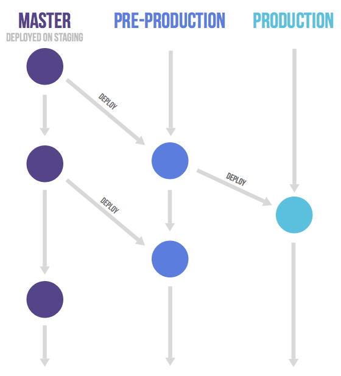

# 工作流简介

## 描述

1. 项目中应存在 `main`, `pre-pre-production`, `pre-production`三个分支，开发者以 `main` 做为上游，在本地创建如 `feature/add-testing`, `fix/issue-xx` 等分支进行开发
2. 项目使用 [black 代码](https://github.com/psf/black), [Google Docsting](https://google.github.io/styleguide/pyguide.html#38-comments-and-docstrings)，[约定式提交信息](https://www.conventionalcommits.org/zh-hans/v1.0.0/)，考虑未来使用 pre-commit 或 Hook 来进行改善
3. 任何重大的代码变更需要由一个阐明目的的 issue 发起。 每个代码变更都有原因，可以帮助团队其他成员了解变更，并且保持特性分支的变更覆盖范围比较小。
4. 可以通过在 Git 提交说明或者合并请求中提到相关 issue 的方式，来链接相关issue。例如：“Fixes #16”, 以达成自动关闭 issue 与将 PR 与 issue 进行关联
5. 通过 Git，您可以使用交互的变基命令（rebase -i）将多个提交聚合为一个，或者对它们重新排序。 这个特性能帮助您以一个单独的提交取代多个小的提交，或者您想使这些提交的顺序更加合理。但除非得到允许，您不应该变基任何他人提交的代码。它不仅会改写变更历史，还会丢失作者信息。
6. 在合并前进行相关单元测使，项目使用 pytest 构建测试用例

## 参考

- [What is Gitlab Flow](https://about.gitlab.com/topics/version-control/what-is-gitlab-flow/)
- [极狐 Github Flow 介绍](https://docs.gitlab.cn/jh/topics/gitlab_flow.html)
- [gitlab flow 大家是怎么优秀使用的，相关实践资料也可以？-知乎](https://www.zhihu.com/question/322574581)
- [What are GitLab Flow best practices?](https://about.gitlab.com/topics/version-control/what-are-gitlab-flow-best-practices/#1-use-feature-branches-rather-than-direct-commits-on-the-main-branch)  
- [Git Flow 与 Gitlab flow 对比 - Google 和腾讯为什么都采用主干开发模式？](https://36kr.com/p/1218375440667012)
- [Git Flow、Github Flow、Gitlab flow 对比 - 高效团队的gitlab flow最佳实践](https://www.cnblogs.com/xiaoqi/p/gitlab-flow.html)