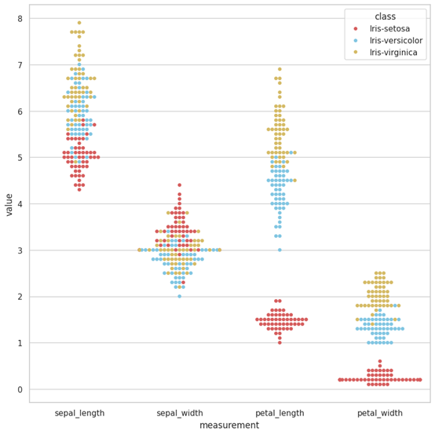
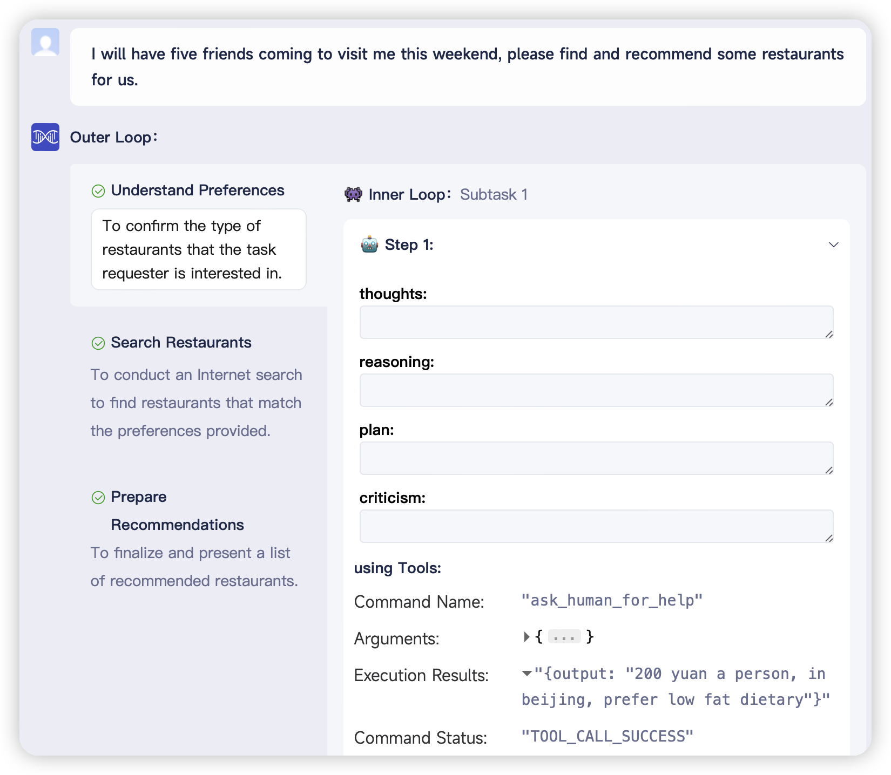
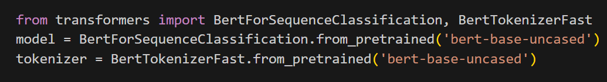
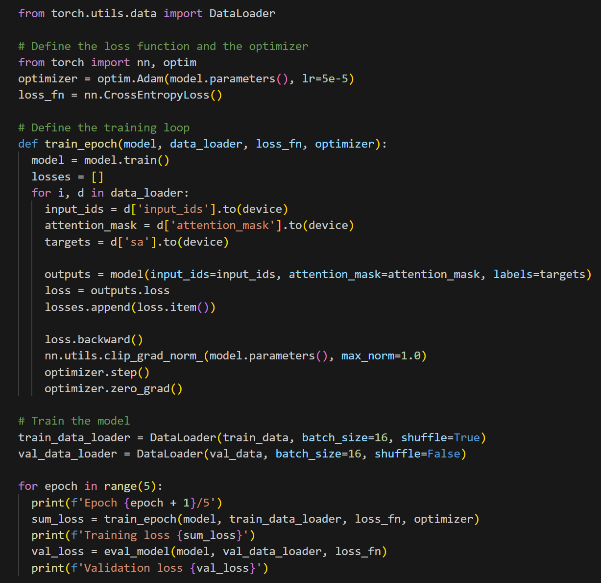
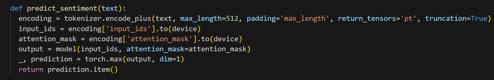

# Demo

Please check out at [Demp playground](https://x-agent.net/share) where we have provided several use cases for you to observe the operation process.

## Case 1. Data Analysis: Demonstrating the Effectiveness of Dual-Loop Mechanism

```bash
Can you help me to use python to analyze the given data?
```

We start with a case of aiding users in intricate data analysis. Here, our user submitted an `iris.zip` file to XAgent, seeking assistance in data analysis. XAgent swiftly broke down the task into four sub-tasks:
1. data inspection and comprehension
2. verification of the system's Python environment for relevant data analysis libraries
3. crafting data analysis code for data processing and analysis
4. compiling an analytical report based on the Python code's execution results.

Here is a figure drawn by XAgent.



## Case 2. Recommendation: A New Paradigm of Human-Agent Interaction

```bash
Find and recommand some restaurant for 8 people around, i prefer sweet and salt favors.
```
Empowered with the unique capability to actively seek human assistance and collaborate in problem-solving, XAgent continues to redefine the boundaries of human-agent cooperation. As depicted in the screenshot below, a user sought XAgent's aid in recommending some great restaurants for a friendly gathering yet failed to provide specific details. Recognizing the insufficiency of the provided information, XAgent employed the AskForHumanHelp tool, prompting human intervention to elicit the user's preferred location, budget constraints, culinary preferences, and dietary restrictions. Armed with this valuable feedback, XAgent seamlessly generated tailored restaurant recommendations, ensuring a personalized and satisfying experience for the user and their friends.



## Case 3. Training Model: A Sophisticated Tool User

```bash
Please write a Python script that analyzes the sentiment of a typical movie reviews dataset. Extract the key phrases that contribute to the overall sentiment and present the results in a visually appealing format.
```
XAgent not only tackles mundane tasks but also serves as an invaluable aid in complex tasks such as model training. Here, we show a scenario where a user desires to analyze movie reviews and evaluate the public sentiment surrounding particular films. In response, XAgent promptly initiates the process by downloading the IMDB dataset to train a cutting-edge BERT model (see screenshot below), harnessing the power of deep learning. Armed with this trained BERT model, XAgent seamlessly navigates the intricate nuances of movie reviews, offering insightful predictions regarding the public's perception of various films.






