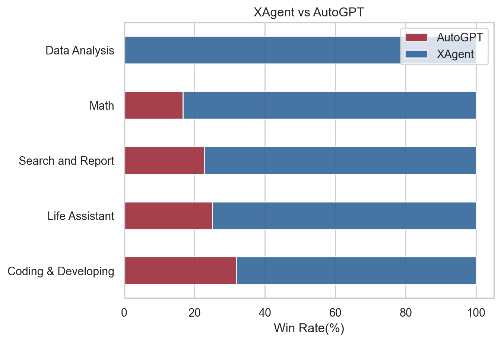
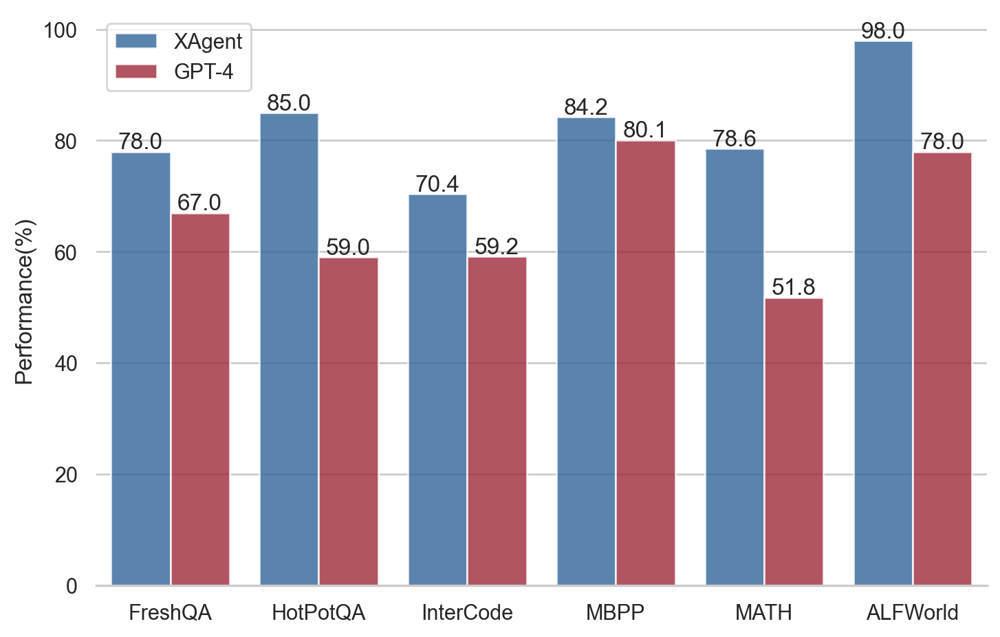

# Evaluation

We conduct human preference evaluation to evaluate XAgent's performance. We prepare over 50 real-world complex tasks for assessment, which can be categorized into 5 classes: Search and Report, Coding and Developing, Data Analysis, Math, and Life Assistant.
We compare the results of XAgent with [AutoGPT](https://github.com/Significant-Gravitas/AutoGPT), which shows a total win of XAgent over AutoGPT. 
All running records will be released soon.

We report a significant improvement of XAgent over AutoGPT in terms of human preference.

